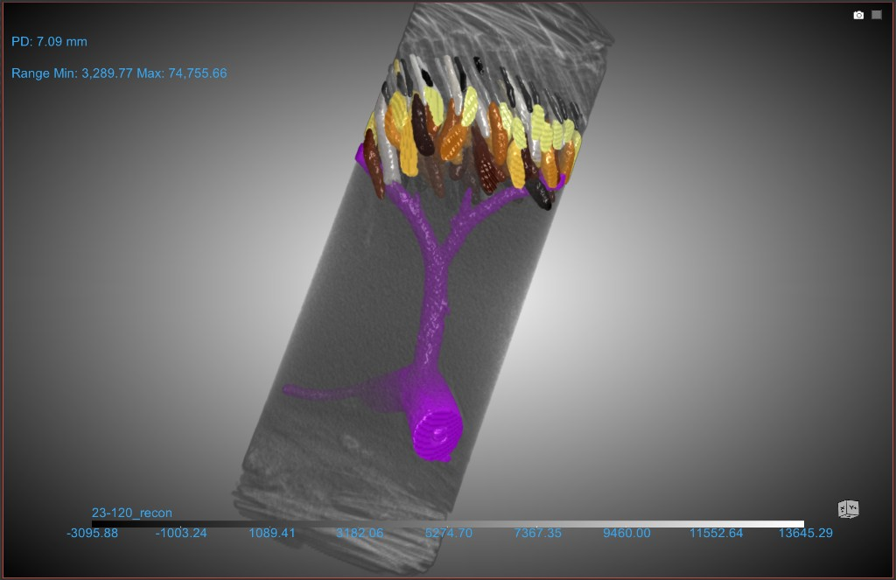
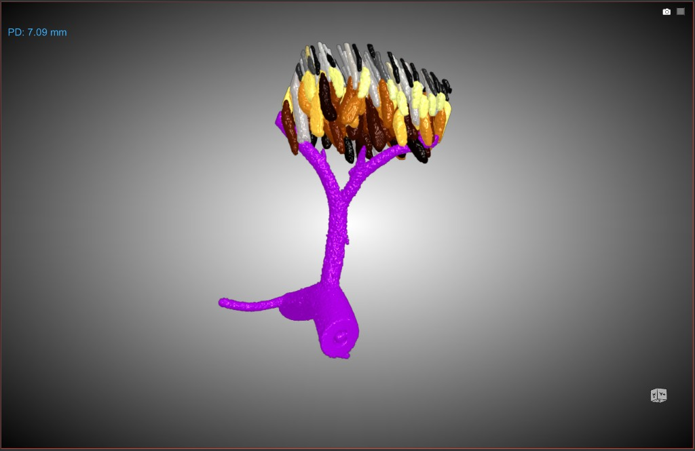

# Cattle Skin Micro-CT Segmentation Pipeline

A reusable pipeline for segmenting hair follicles, sweat glands, and blood
vessels in bovine skin biopsies scanned by micro-computed tomography. The
pipeline combines threshold-based manual segmentation with 2.5D U-Net deep
learning models inside [Dragonfly](https://dragonfly.comet.tech/) and produces
per-structure CSV exports that are consolidated into a single master
measurements spreadsheet.

The repository distributes the operator protocols, conversion utilities,
analysis scripts, and Dragonfly tutorial notes needed to reproduce the
workflow on your own data. No experimental dataset is shipped; see
[`data/README.md`](data/README.md).

## Preview

A short volumetric fly-through of a DL-segmented sweat-gland network in a
bovine skin biopsy (sample 22-10), rendered in Dragonfly:


Full-biopsy segmentation output on sample 23-120 — hair follicles (multi-
coloured), sweat-gland coil (purple, lower), and blood-vessel tree (purple,
branching) — shown overlaid on the μCT tissue cylinder (left) and isolated
(right):

<p align="center">
  
  
</p>

## Quick start

1. **Clone the repository** and create a Python environment (Python ≥ 3.10).

    ```bash
    git clone https://github.com/csantosvet/cattle-skin-dl-segmentation.git
    cd cattle-skin-dl-segmentation
    python -m venv .venv
    .venv\Scripts\activate           # Windows
    # source .venv/bin/activate       # macOS / Linux
    pip install -r requirements.txt
    ```

2. **Convert raw reconstructions to TIFF** using the conversion utilities
   (see [`protocols/01_TXM_to_TIFF_Conversion.md`](protocols/01_TXM_to_TIFF_Conversion.md)):

    ```bash
    python conversion/convert_txm_to_tiff.py \
        --input  <path-to-recon.txm> \
        --output <path-to-output.tif>
    ```

    For a directory tree of reconstructions, use the resumable batch runner:

    ```bash
    python conversion/batch_convert_all.py \
        --source-root <raw-scan-root> \
        --output-root <tiff-stack-root>
    ```

3. **Segment each sample in Dragonfly**, following either:

    - [`protocols/02_Manual_Segmentation_Dragonfly.md`](protocols/02_Manual_Segmentation_Dragonfly.md) — threshold-based manual segmentation, or
    - [`protocols/03_AI_Segmentation_Wizard_Automation.md`](protocols/03_AI_Segmentation_Wizard_Automation.md) — DL-assisted segmentation (recommended once training samples are available).

    Export per-structure CSVs from Dragonfly into `03_RESULTS/Hair/`,
    `03_RESULTS/SweatGlands/`, and `03_RESULTS/BloodVessels/` as described
    in [`protocols/04_Data_Management_and_Scripts.md`](protocols/04_Data_Management_and_Scripts.md).

4. **Consolidate per-sample CSVs** into a master measurements file:

    ```bash
    python scripts/populate_master_csv.py \
        --results-dir <project-root>/03_RESULTS \
        --master-csv  <project-root>/master_measurements.csv
    ```

5. **(Optional) Audit CSV placement** to catch mis-filed exports, and
   **normalize** intensity distributions between scanning sessions:

    ```bash
    python scripts/audit_csv_placement.py --results-dir <project-root>/03_RESULTS
    python scripts/normalize_volume.py \
        --source    <path-to-source.tif> \
        --reference <path-to-reference.tif> \
        --output    <path-to-normalized.tif>
    ```

## Repository structure

```text
cattle-skin-dl-segmentation/
├── LICENSE                       # MIT (code) + CC BY 4.0 (protocols & tutorials)
├── README.md
├── CITATION.cff                  # How to cite this repository
├── CHANGELOG.md
├── requirements.txt              # Pinned Python dependencies
├── .gitignore
├── protocols/
│   ├── 01_TXM_to_TIFF_Conversion.md
│   ├── 02_Manual_Segmentation_Dragonfly.md
│   ├── 03_AI_Segmentation_Wizard_Automation.md
│   ├── 04_Data_Management_and_Scripts.md
│   └── images/                   # Operator-training screenshots
├── scripts/
│   ├── populate_master_csv.py    # Consolidate per-structure CSVs
│   ├── audit_csv_placement.py    # QC for mis-filed CSV exports
│   ├── normalize_volume.py       # Intensity normalization between sessions
│   └── rebuild_production_csv.py # Parse a Markdown production log into CSVs
├── conversion/
│   ├── convert_txm_to_tiff.py    # Single-volume TXM → TIFF converter
│   └── batch_convert_all.py      # Safe, resumable batch converter
├── tutorials/
│   └── Dragonfly_Tutorials.md
└── data/
    └── README.md                 # Data policy and project layout
```

## Trained models

Pre-trained 2.5D U-Net models for hair and sweat-gland segmentation are
distributed as Dragonfly Deep Learning Tool exports (ZIP archives) and
attached to the **`v1.1.0` GitHub Release**. Download them from the
[Releases page](https://github.com/csantosvet/cattle-skin-dl-segmentation/releases/tag/v1.1.0).

| Asset                                                        | Segments     | Size   |
| ------------------------------------------------------------ | ------------ | ------ |
| `HAIR_SegWiz_Standard_v1_<uuid>.zip`                         | Hair follicles | ~78 MB |
| `SG_SegWiz_Standard_v1_<uuid>.zip`                           | Sweat glands   | ~78 MB |

Blood-vessel segmentation is performed manually; no DL model ships for
blood vessels in this release.

### Importing a model ZIP into Dragonfly

The ZIPs are Dragonfly **Deep Learning Tool** exports. Import them once per
workstation; after import, the models are also available inside the
**Segmentation Wizard** without any further action.

1. Open Dragonfly 2024.1 or later.
2. From the menu bar, choose **Artificial Intelligence → Deep Learning Tool**.
3. In the **Model Overview** panel, click **Import Zip** and select the
   downloaded `.zip` file. Repeat for the second model.
4. The imported models now appear in the Model Overview list with their
   type (semantic segmentation) and class count. You can preview them from
   the Deep Learning Tool directly, or use them from the Segmentation
   Wizard via **Start with Model** as described in
   [`protocols/03_AI_Segmentation_Wizard_Automation.md`](protocols/03_AI_Segmentation_Wizard_Automation.md).

### Applicability and expected behavior

These models were trained on bovine skin biopsies scanned on a Zeiss Xradia
Versa system at **0.00784727 mm isotropic voxel size** inside a **2 mm
cylinder mask**. When applied to new samples:

- Expected to work best on samples whose gray-value distribution overlaps
  the training envelope. Out-of-distribution samples (very different
  intensity range) may fail completely; see Protocol 03 Part E for the
  failure modes and the `scripts/normalize_volume.py` calibration option.
- The operator is expected to review every prediction and run Connected
  Components cleanup (Protocol 02) before measurement.
- For cohorts that differ substantially in scanner settings, sample
  preparation, or species, fine-tuning on 2–3 locally segmented samples is
  recommended (see Protocol 03 Part B).

## Software requirements

- **Dragonfly** 2024.1 or later (external; required for all segmentation
  steps and for training/running the DL models). Dragonfly itself is not
  distributed with this repository.
- **Python** ≥ 3.10 with the packages pinned in [`requirements.txt`](requirements.txt).
- **Operating system**: all scripts are platform-agnostic; protocol examples
  are written for Windows paths but work unchanged on macOS and Linux when
  the path arguments are adjusted.

## Data

This repository distributes code, protocols, and operator-training images only.
No experimental dataset is shipped; see [`data/README.md`](data/README.md) for
the expected project layout and how to apply the pipeline to your own data.

## Citation

If this pipeline is useful in your work, please cite this repository using the
metadata in [`CITATION.cff`](CITATION.cff).

## License

Code is released under the **MIT License**; protocols and tutorials under
**CC BY 4.0**. See [`LICENSE`](LICENSE) for the full text.
